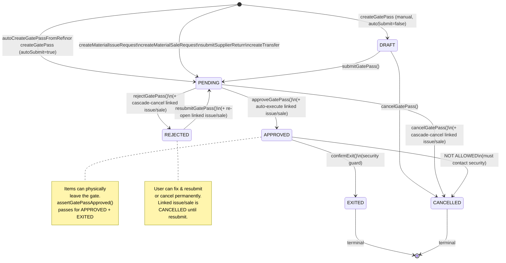
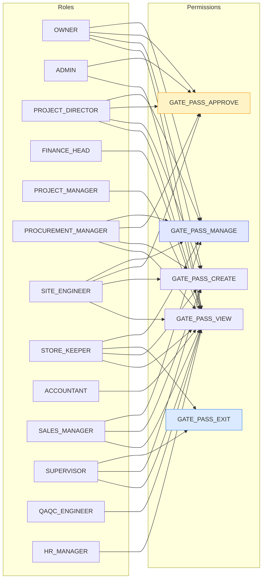
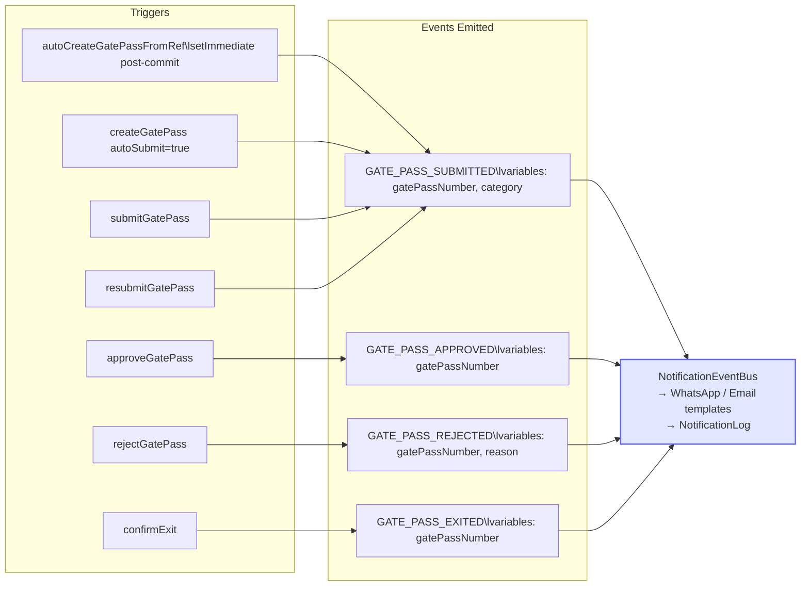
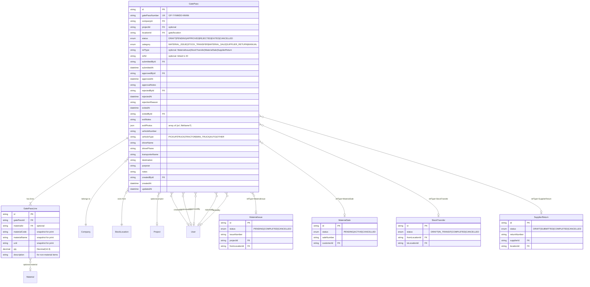

# Gate Pass System — Complete Flow Map

> Generated 2026-08-20. Documents every page, service function, API route,
> status transition, integration point, permission, and edge case in the
> Gate Pass system.

---

## 1. Status State Machine



---

## 2. System Architecture — Pages & Connections

```mermaid
graph TB
    subgraph "Source Transactions"
        MI[Material Issue\n/stock → Issues Tab]
        ST[Stock Transfer\n/stock → Transfers Tab]
        MS[Material Sale\n/material-sales]
        SR[Supplier Return\n/supplier-returns]
    end

    subgraph "Gate Pass Core"
        GP_PAGE[/gate-passes\nDesktop List + Detail]
        GP_MOBILE[/m/gate-pass\nMobile List]
        GP_PRINT[/print/gate-pass/[id]\nPrint Layout]
        GP_API[API Routes\n/api/gate-passes]
        GP_SERVICE[Service Layer\npackages/services/gate-pass.ts]
        GP_DB[(Database\ngate_pass + gate_pass_line)]
    end

    subgraph "Approval & Security"
        APPROVALS[/approvals\nApproval Dashboard]
        SECURITY[Security Guard\n/m/gate-pass → Confirm Exit]
    end

    subgraph "Integration Touchpoints"
        MI_DETAIL[Mobile Issue Detail\n/m/stock]
        ST_DETAIL[Mobile Transfer Detail\n/m/transfers/[id]]
        MS_DETAIL[Mobile Sale Detail\n/m/material-sales/[id]]
        SR_DETAIL[Mobile Supplier Return\n/m/supplier-returns/[id]]
    end

    %% Source → Gate Pass creation
    MI -->|"createMaterialIssueRequest()\nrequireGatePass=true"| GP_SERVICE
    ST -->|"createTransfer()\nauto-creates GP"| GP_SERVICE
    MS -->|"createMaterialSaleRequest()\nrequireGatePass=true"| GP_SERVICE
    SR -->|"submitSupplierReturn()\nauto-creates GP"| GP_SERVICE

    GP_SERVICE --> GP_DB
    GP_SERVICE -->|"notification event"| NOTIF[Notification Bus\nWhatsApp/Email]
    GP_API --> GP_SERVICE
    GP_API --> GP_DB

    %% Pages → API
    GP_PAGE -->|"GET /api/gate-passes"| GP_API
    GP_PAGE -->|"POST /api/gate-passes"| GP_API
    GP_PAGE -->|"PATCH /api/gate-passes/[id]"| GP_API
    GP_MOBILE -->|"PATCH /api/gate-passes/[id]"| GP_API
    GP_PRINT -->|"prisma.gatePass.findFirst"| GP_DB
    APPROVALS -->|"prisma.gatePass.findMany\nstatus=PENDING"| GP_DB

    %% Gate pass → back to source (auto-execute)
    GP_SERVICE -->|"approveGatePass()\nrefType=MaterialIssue"| MI_EXEC[executeMaterialIssue]
    GP_SERVICE -->|"approveGatePass()\nrefType=MaterialSale"| MS_EXEC[executeMaterialSale]
    GP_SERVICE -->|"rejectGatePass()\ncascade cancel"| MI_CANCEL[MaterialIssue → CANCELLED]
    GP_SERVICE -->|"rejectGatePass()\ncascade cancel"| MS_CANCEL[MaterialSale → CANCELLED]
    GP_SERVICE -->|"cancelGatePass()\ncascade cancel"| MI_CANCEL
    GP_SERVICE -->|"cancelGatePass()\ncascade cancel"| MS_CANCEL
    GP_SERVICE -->|"resubmitGatePass()\nre-open"| MI_REOPEN[MaterialIssue → PENDING]
    GP_SERVICE -->|"resubmitGatePass()\nre-open"| MS_REOPEN[MaterialSale → PENDING]

    %% Guard checks
    ST -->|"dispatchTransfer()\nassertGatePassApproved()"| GP_SERVICE
    SR -->|"completeSupplierReturn()\nassertGatePassApproved()"| GP_SERVICE
    MI_EXEC -->|"assertGatePassApproved()"| GP_SERVICE
    MS_EXEC -->|"assertGatePassApproved()"| GP_SERVICE

    %% Integration touchpoints show gate pass status
    ST_DETAIL -->|"shows GP banner\nif DRAFT + GP exists"| GP_MOBILE
    SR_DETAIL -->|"shows GP banner\nif SUBMITTED"| GP_MOBILE
    MS_DETAIL -->|"shows GP banner\nif PENDING"| GP_MOBILE

    %% Nav
    NAV[Sidebar Nav\n/gate-passes\nbadge: PENDING count] --> GP_PAGE
    MOBILE_NAV[Mobile Nav] --> GP_MOBILE

    style GP_SERVICE fill:#fef3c7,stroke:#f59e0b,stroke-width:2px
    style GP_DB fill:#e0e7ff,stroke:#6366f1
    style APPROVALS fill:#d1fae5,stroke:#10b981
    style SECURITY fill:#dbeafe,stroke:#3b82f6
```

---

## 3. Material Issue Flow (Gate-Pass-Gated)

```mermaid
flowchart TD
    START([User opens Issue Form\n/stock → Issues Tab]) --> CHECK_TARGET{Issue target?}

    CHECK_TARGET -->|"target = PROJECT"| GP_FLOW[Gate-Pass-Gated Flow]
    CHECK_TARGET -->|"target = DEPARTMENT\nor requireGatePass=false"| DIRECT_FLOW[Direct Execution Flow]

    %% Gate pass flow
    GP_FLOW --> SUBMIT_ISSUE[Submit form with\nrequireGatePass: true]
    SUBMIT_ISSUE --> API_POST[POST /api/issue-materials]
    API_POST --> CREATE_REQ[createMaterialIssueRequest\l- Create MaterialIssue status=PENDING\l- autoCreateGatePassFromRef\l  category=MATERIAL_ISSUE\l  status=PENDING]
    CREATE_REQ --> NOTIFY1[Emit GATE_PASS_SUBMITTED\nnotification]
    NOTIFY1 --> TOAST1[Toast: "Gate pass created\l— awaiting approval"\l+ "View Gate Passes" button]
    TOAST1 --> SHOW_PENDING[Issues Tab shows\n"Awaiting Gate Pass" badge]

    SHOW_PENDING --> WAIT_APPROVAL{Gate Pass\nApproval?}

    WAIT_APPROVAL -->|"approveGatePass()"| AUTO_EXEC[Auto-execute:\lexecuteMaterialIssue\l- assertGatePassApproved ✓\l- recordMovement ISSUE_TO_PROJECT\l- Update MAC cost\l- Set status=COMPLETED\l- Post GL entry]
    AUTO_EXEC --> ISSUE_DONE([Issue COMPLETED\nStock reduced\nProject cost updated])

    WAIT_APPROVAL -->|"rejectGatePass()"| CASCADE_CANCEL[Cascade:\l- GatePass → REJECTED\l- MaterialIssue → CANCELLED]
    CASCADE_CANCEL --> SHOW_REJECTED[Issues Tab shows\n"Cancelled" badge]
    SHOW_REJECTED --> USER_CHOICE{User action?}
    USER_CHOICE -->|"resubmitGatePass()"| REOPEN[Re-open:\l- GatePass → PENDING\l- MaterialIssue → PENDING]
    REOPEN --> WAIT_APPROVAL
    USER_CHOICE -->|"cancelGatePass()\nor leave cancelled"| DONE_CANCEL([Issue CANCELLED\nNo stock moved])

    WAIT_APPROVAL -->|"cancelGatePass()"| CASCADE_CANCEL2[Cascade:\l- GatePass → CANCELLED\l- MaterialIssue → CANCELLED]
    CASCADE_CANCEL2 --> DONE_CANCEL

    %% Direct flow (no gate pass)
    DIRECT_FLOW --> SUBMIT_DIRECT[Submit form with\nrequireGatePass: false]
    SUBMIT_DIRECT --> API_POST2[POST /api/issue-materials]
    API_POST2 --> EXEC_DIRECT[issueMaterials\l- recordMovement immediately\l- status=COMPLETED]
    EXEC_DIRECT --> DONE_DIRECT([Issue COMPLETED immediately\nNo gate pass created])

    style GP_FLOW fill:#fef3c7,stroke:#f59e0b
    style AUTO_EXEC fill:#d1fae5,stroke:#10b981
    style CASCADE_CANCEL fill:#fee2e2,stroke:#ef4444
    style DIRECT_FLOW fill:#e0e7ff,stroke:#6366f1
```

---

## 4. Stock Transfer Flow (Gate-Pass-Gated)

```mermaid
flowchart TD
    START([User creates Transfer\n/stock → Transfers Tab]) --> CREATE[createTransfer\l- Create StockTransfer status=DRAFT\l- autoCreateGatePassFromRef\l  category=STOCK_TRANSFER\l  status=PENDING]
    CREATE --> NOTIFY[Emit GATE_PASS_SUBMITTED]
    NOTIFY --> SHOW_DRAFT[Transfer shows as DRAFT\nMobile detail shows\nGP status banner]

    SHOW_DRAFT --> USER_DISPATCH[User clicks Dispatch\n/mobile or /stock]
    USER_DISPATCH --> API_DISPATCH[PATCH /api/transfers/[id]\naction: dispatch]
    API_DISPATCH --> CHECK_GP{assertGatePassApproved\n"StockTransfer", id}

    CHECK_GP -->|"No GP found"| ERROR_NO_GP[Error 403:\n"No gate pass found\lItems cannot leave without GP"]
    CHECK_GP -->|"GP status = PENDING"| ERROR_PENDING[Error 403:\n"GP is PENDING\l— cannot leave until approved"]
    CHECK_GP -->|"GP status = REJECTED"| ERROR_REJECTED[Error 403:\n"GP is REJECTED"]
    CHECK_GP -->|"GP status = DRAFT"| ERROR_DRAFT[Error 403:\n"GP is DRAFT"]
    CHECK_GP -->|"GP status = APPROVED\nor EXITED"| DISPATCH_OK[dispatchTransfer\l- recordTransfer movements\l- status=IN_TRANSIT]

    DISPATCH_OK --> IN_TRANSIT([Transfer IN_TRANSIT\nStock moved from source])

    %% Approval path
    SHOW_DRAFT --> APPROVE_GP[Approver approves GP\n/gate-passes or /approvals]
    APPROVE_GP --> APPROVED[GatePass → APPROVED\nNo auto-execute for transfers\n(transfers dispatch manually)]
    APPROVED --> USER_DISPATCH

    %% Rejection path
    SHOW_DRAFT --> REJECT_GP[Approver rejects GP]
    REJECT_GP --> REJECTED[GatePass → REJECTED\nTransfer stays DRAFT\l(no cascade for transfers)]
    REJECTED --> USER_RESUBMIT{User action?}
    USER_RESUBMIT -->|"resubmitGatePass()"| BACK_TO_PENDING[GP → PENDING]
    BACK_TO_PENDING --> APPROVE_GP
    USER_RESUBMIT -->|"Cancel transfer\nPATCH action: cancel"| CANCEL_TX([Transfer CANCELLED])

    style CHECK_GP fill:#fef3c7,stroke:#f59e0b,stroke-width:2px
    style DISPATCH_OK fill:#d1fae5,stroke:#10b981
    style ERROR_NO_GP fill:#fee2e2,stroke:#ef4444
    style ERROR_PENDING fill:#fee2e2,stroke:#ef4444
```

---

## 5. Material Sale Flow (Gate-Pass-Gated)

```mermaid
flowchart TD
    START([User opens Sale Form\n/material-sales]) --> SUBMIT[Submit form with\nrequireGatePass: true]
    SUBMIT --> API[POST /api/material-sales]
    API --> CREATE_REQ[createMaterialSaleRequest\l- Create MaterialSale status=PENDING\l- autoCreateGatePassFromRef\l  per location (one GP per location)\l  category=MATERIAL_SALE\l  status=PENDING]
    CREATE_REQ --> NOTIFY[Emit GATE_PASS_SUBMITTED\nper gate pass]
    NOTIFY --> TOAST[Toast: "Gate pass created\l— awaiting approval"]
    TOAST --> SHOW_PENDING[Sale list shows\n"Gate Pass" badge\nrow tone: warning]

    SHOW_PENDING --> WAIT{Gate Pass\nApproval?}

    WAIT -->|"approveGatePass()\n(all GPs for this sale)"| AUTO_EXEC[Auto-execute:\lexecuteMaterialSale\l- assertGatePassApproved ✓\l- recordMovement SALE_OUT\l- status=ACTIVE\l- Post GL: Sale + Output GST]
    AUTO_EXEC --> SALE_ACTIVE([Sale ACTIVE\nStock reduced\nInvoice printable])

    WAIT -->|"rejectGatePass()"| CASCADE[Cascade:\l- GatePass → REJECTED\l- MaterialSale → CANCELLED]
    CASCADE --> SHOW_CANCEL[Sale list shows\lCANCELLED row tone]
    SHOW_CANCEL --> CHOICE{User action?}
    CHOICE -->|"resubmitGatePass()"| REOPEN[Re-open:\l- GP → PENDING\l- Sale → PENDING]
    REOPEN --> WAIT
    CHOICE -->|"leave cancelled"| DONE([Sale CANCELLED\nNo stock moved])

    WAIT -->|"cancelGatePass()"| CASCADE2[Cascade:\l- GP → CANCELLED\l- Sale → CANCELLED]
    CASCADE2 --> DONE

    %% Edge case: multiple locations = multiple gate passes
    CREATE_REQ -.->|"if lines span\nmultiple locations"| MULTI_GP[Multiple GPs created\none per location\nAll must be approved\nbefore executeMaterialSale]
    MULTI_GP --> WAIT

    style AUTO_EXEC fill:#d1fae5,stroke:#10b981
    style CASCADE fill:#fee2e2,stroke:#ef4444
    style MULTI_GP fill:#e0e7ff,stroke:#6366f1
```

---

## 6. Supplier Return Flow (Gate-Pass-Gated)

```mermaid
flowchart TD
    START([User creates Return\n/supplier-returns]) --> DRAFT[Create SupplierReturn\nstatus=DRAFT\nNo gate pass yet]
    DRAFT --> SUBMIT[User clicks Submit\nPATCH action: submit]
    SUBMIT --> SUBMIT_SVC[submitSupplierReturn\l- status=SUBMITTED\l- autoCreateGatePassFromRef\l  category=SUPPLIER_RETURN\l  status=PENDING]
    SUBMIT_SVC --> NOTIFY[Emit GATE_PASS_SUBMITTED]
    NOTIFY --> SHOW_SUBMITTED[Return shows SUBMITTED\nMobile detail shows\nGP status banner]

    SHOW_SUBMITTED --> WAIT{Gate Pass\nApproval?}

    WAIT -->|"GP approved"| READY[GP → APPROVED\nNo auto-execute for returns\n(returns complete manually)]
    READY --> USER_COMPLETE[User clicks Complete\nPATCH action: complete]
    USER_COMPLETE --> CHECK_GP{assertGatePassApproved\n"SupplierReturn", id}
    CHECK_GP -->|"APPROVED or EXITED"| COMPLETE[completeSupplierReturn\l- recordMovement RETURN\l- stock decreases\l- Post GL: SupplierReturn\l- status=COMPLETED]
    COMPLETE --> DONE([Return COMPLETED\nStock returned to supplier\nCredit note recorded])

    CHECK_GP -->|"GP not approved"| ERROR[Error 403:\n"GP is [status]\l— cannot complete until approved"]

    WAIT -->|"GP rejected"| REJECTED[GP → REJECTED\nReturn stays SUBMITTED\n(no cascade for returns)]
    REJECTED --> CHOICE{User action?}
    CHOICE -->|"resubmitGatePass()"| REOPEN[GP → PENDING]
    REOPEN --> WAIT
    CHOICE -->|"Cancel return\nPATCH action: cancel"| CANCEL([Return CANCELLED])

    WAIT -->|"GP cancelled"| GP_CANCELLED[GP → CANCELLED\nReturn stays SUBMITTED]
    GP_CANCELLED --> CHOICE

    style CHECK_GP fill:#fef3c7,stroke:#f59e0b,stroke-width:2px
    style COMPLETE fill:#d1fae5,stroke:#10b981
    style ERROR fill:#fee2e2,stroke:#ef4444
```

---

## 7. Manual Gate Pass Flow (Standalone)

```mermaid
flowchart TD
    START([User clicks "New Gate Pass"\n/gate-passes]) --> FORM[Gate Pass Form Dialog\l- Location, Project\l- Line items (material or description)\l- Vehicle, driver, transporter\l- Destination, purpose\l- autoSubmit toggle])
    FORM --> SUBMIT{autoSubmit?}
    SUBMIT -->|"true"| POST_PENDING[POST /api/gate-passes\nautoSubmit: true]
    SUBMIT -->|"false"| POST_DRAFT[POST /api/gate-passes\nautoSubmit: false]
    POST_PENDING --> CREATE_PENDING[createGatePass\lstatus=PENDING\lEmit notification]
    POST_DRAFT --> CREATE_DRAFT[createGatePass\lstatus=DRAFT]
    CREATE_PENDING --> WAIT{Approval flow}
    CREATE_DRAFT --> USER_SUBMIT[User clicks Submit\nin detail dialog]
    USER_SUBMIT --> SUBMIT_SVC[submitGatePass\lDRAFT → PENDING\lEmit notification]
    SUBMIT_SVC --> WAIT

    WAIT -->|"Approve"| APPROVED[status=APPROVED\lNo auto-execute\l(category=MANUAL\lno refType/refId)]
    WAIT -->|"Reject"| REJECTED[status=REJECTED]
    WAIT -->|"Cancel"| CANCELLED[status=CANCELLED]

    APPROVED --> SECURITY{Security guard\nconfirms exit?}
    SECURITY -->|"confirmExit()"| EXITED([status=EXITED\lexitNotes recorded])
    SECURITY -->|"no action"| STAYS_APPROVED([Stays APPROVED\nitems may still leave])

    REJECTED --> RESUBMIT{User resubmits?}
    RESUBMIT -->|"yes"| BACK_PENDING[resubmitGatePass\l→ PENDING]
    BACK_PENDING --> WAIT
    RESUBMIT -->|"no"| STAYS_REJECTED([Stays REJECTED])

    style CREATE_PENDING fill:#d1fae5,stroke:#10b981
    style APPROVED fill:#dbeafe,stroke:#3b82f6
    style EXITED fill:#d1fae5,stroke:#10b981
    style REJECTED fill:#fee2e2,stroke:#ef4444
```

---

## 8. Permission Matrix



### Permission → Action Mapping

| Permission | Actions Allowed |
|---|---|
| `GATE_PASS_VIEW` | View gate pass list, detail dialog, print page, approvals page |
| `GATE_PASS_CREATE` | Create manual GP, submit DRAFT→PENDING, resubmit REJECTED→PENDING |
| `GATE_PASS_APPROVE` | Approve PENDING→APPROVED, reject PENDING→REJECTED |
| `GATE_PASS_EXIT` | Confirm exit APPROVED→EXITED (security guard) |
| `GATE_PASS_MANAGE` | Cancel DRAFT/PENDING→CANCELLED |

### Self-Approval Prevention

```
if (gp.createdById && gp.createdById === approverId) {
    throw "Cannot approve your own gate pass";
}
```

---

## 9. Page → Data → Action Map

```mermaid
graph TD
    subgraph "Desktop Pages"
        GP_PAGE["/gate-passes\n(Server Component)"]
        GP_VIEW[GatePassesView\n(Client Component)]
        GP_DETAIL[GatePassDetailDialog]
        GP_FORM[GatePassFormDialog]
        APPROVALS["/approvals\n(Server Component)"]
        STOCK["/stock\n(Server Component)"]
        MAT_SALES["/material-sales\n(Server Component)"]
    end

    subgraph "Mobile Pages"
        M_GP["/m/gate-pass\n(Server Component)"]
        M_GP_LIST[MobileGatePassList\n(Client Component)]
        M_TRANSFER["/m/transfers/[id]\n(Server Component)"]
        M_SALE["/m/material-sales/[id]\n(Server Component)"]
        M_RETURN["/m/supplier-returns/[id]\n(Server Component)"]
    end

    subgraph "Print"
        PRINT["/print/gate-pass/[id]\n(Server Component)"]
    end

    subgraph "API Routes"
        API_LIST["GET /api/gate-passes"]
        API_CREATE["POST /api/gate-passes"]
        API_DETAIL["GET /api/gate-passes/[id]"]
        API_ACTION["PATCH /api/gate-passes/[id]"]
        API_APPROVALS["GET /api/approvals"]
        API_ISSUE["POST+PATCH /api/issue-materials"]
        API_SALE["POST+PATCH /api/material-sales"]
        API_TRANSFER["PATCH /api/transfers/[id]"]
        API_RETURN["PATCH /api/supplier-returns/[id]"]
    end

    GP_PAGE -->|"prisma.gatePass.findMany"| GP_VIEW
    GP_VIEW --> GP_DETAIL
    GP_VIEW --> GP_FORM
    GP_FORM -->|"POST"| API_CREATE
    GP_DETAIL -->|"PATCH"| API_ACTION
    GP_DETAIL -->|"window.open"| PRINT

    M_GP -->|"prisma.gatePass.findMany"| M_GP_LIST
    M_GP_LIST -->|"PATCH"| API_ACTION
    M_GP_LIST -->|"window.open"| PRINT

    APPROVALS -->|"prisma.gatePass.findMany\nstatus=PENDING"| APPROVALS_VIEW[Inline GP section]

    STOCK -->|"prisma.materialIssue.findMany\nincludes status"| ISSUES_TAB[IssuesTab\nshows PENDING badge]
    MAT_SALES -->|"prisma.materialSale.findMany\nincludes status"| SALES_VIEW[MaterialSalesView\nshows Gate Pass badge]

    M_TRANSFER -->|"prisma.gatePass.findFirst\nrefType=StockTransfer"| M_TRANSFER_CLIENT[MobileTransferDetailClient\nshows GP banner]
    M_SALE -->|"prisma.gatePass.findFirst\nrefType=MaterialSale"| M_SALE_CLIENT[MobileMaterialSaleDetailClient\nshows GP banner]
    M_RETURN -->|"prisma.gatePass.findFirst\nrefType=SupplierReturn"| M_RETURN_DETAIL[Mobile supplier return detail\nshows GP banner]

    PRINT -->|"prisma.gatePass.findFirst"| PRINT_LAYOUT[Print layout\nGP number, items, signatures]

    API_CREATE --> SVC_CREATE[createGatePass]
    API_ACTION --> SVC_SUBMIT[submitGatePass]
    API_ACTION --> SVC_APPROVE[approveGatePass\n+ auto-execute]
    API_ACTION --> SVC_REJECT[rejectGatePass\n+ cascade cancel]
    API_ACTION --> SVC_RESUBMIT[resubmitGatePass\n+ re-open]
    API_ACTION --> SVC_EXIT[confirmExit]
    API_ACTION --> SVC_CANCEL[cancelGatePass\n+ cascade cancel]

    style GP_PAGE fill:#e0e7ff,stroke:#6366f1
    style M_GP fill:#dbeafe,stroke:#3b82f6
    style PRINT fill:#d1fae5,stroke:#10b981
    style API_ACTION fill:#fef3c7,stroke:#f59e0b,stroke-width:2px
```

---

## 10. All If/Else Scenarios — Complete Edge Case Map

```mermaid
flowchart TD
    ROOT[Gate Pass Action Request] --> CHECK_COMPANY{Gate pass belongs\nto user's company?}
    CHECK_COMPANY -->|"NO"| ERR_404[404: Not found]
    CHECK_COMPANY -->|"YES"| CHECK_PERM{Has required\npermission?}
    CHECK_PERM -->|"NO"| ERR_403[403: Forbidden]

    CHECK_PERM -->|"YES"| ACTION{Action type?}

    %% SUBMIT
    ACTION -->|"submit"| S1{status == DRAFT?}
    S1 -->|"YES"| S_OK[→ PENDING\nEmit notification]
    S1 -->|"NO"| S_ERR["Error:\nCannot submit in status X"]

    %% APPROVE
    ACTION -->|"approve"| A1{status == PENDING?}
    A1 -->|"NO"| A_ERR["Error:\nCannot approve in status X"]
    A1 -->|"YES"| A2{createdById == approverId?}
    A2 -->|"YES"| A_SELF["Error:\nCannot approve your own GP"]
    A2 -->|"NO"| A_OK[→ APPROVED\nEmit notification]
    A_OK --> A3{refType?}
    A3 -->|"MaterialIssue"| A_EXEC_MI[Auto-execute:\nexecuteMaterialIssue]
    A3 -->|"MaterialSale"| A_EXEC_MS[Auto-execute:\nexecuteMaterialSale]
    A3 -->|"StockTransfer"| A_NO_EXEC[No auto-execute\n(dispatch is manual)]
    A3 -->|"SupplierReturn"| A_NO_EXEC
    A3 -->|"null (MANUAL)"| A_NO_EXEC
    A_EXEC_MI --> A_EXEC_CHECK{assertGatePassApproved\npasses?}
    A_EXEC_MS --> A_EXEC_CHECK
    A_EXEC_CHECK -->|"YES"| A_EXEC_OK[Issue/Sale → COMPLETED\nStock moved\nGL posted]
    A_EXEC_CHECK -->|"NO"| A_EXEC_FAIL["Log error:\nAuto-execution failed\nUser can manually execute\nvia PATCH /api/issue-materials\nor PATCH /api/material-sales"]

    %% REJECT
    ACTION -->|"reject"| R1{status == PENDING?}
    R1 -->|"NO"| R_ERR["Error:\nCannot reject in status X"]
    R1 -->|"YES"| R2{reason provided?}
    R2 -->|"NO"| R_REASON["400:\nRejection reason required"]
    R2 -->|"YES"| R_OK[→ REJECTED\nEmit notification]
    R_OK --> R3{refType?}
    R3 -->|"MaterialIssue\n+ issue.status=PENDING"| R_CASCADE_MI[MaterialIssue → CANCELLED]
    R3 -->|"MaterialSale\n+ sale.status=PENDING"| R_CASCADE_MS[MaterialSale → CANCELLED]
    R3 -->|"StockTransfer"| R_NO_CASCADE[No cascade\nTransfer stays DRAFT]
    R3 -->|"SupplierReturn"| R_NO_CASCADE[No cascade\nReturn stays SUBMITTED]
    R3 -->|"null"| R_NO_CASCADE

    %% RESUBMIT
    ACTION -->|"resubmit"| RS1{status == REJECTED?}
    RS1 -->|"NO"| RS_ERR["Error:\nCannot resubmit in status X"]
    RS1 -->|"YES"| RS_OK[→ PENDING\nClear rejection fields\nEmit notification]
    RS_OK --> RS2{refType?}
    RS2 -->|"MaterialIssue\n+ issue.status=CANCELLED"| RS_REOPEN_MI[MaterialIssue → PENDING]
    RS2 -->|"MaterialSale\n+ sale.status=CANCELLED"| RS_REOPEN_MS[MaterialSale → PENDING]
    RS2 -->|"other"| RS_NO_REOPEN[No re-open]

    %% CONFIRM EXIT
    ACTION -->|"confirmExit"| E1{status == APPROVED?}
    E1 -->|"NO"| E_ERR["Error:\nCannot confirm exit\nin status X.\nItems can only exit\nafter approval."]
    E1 -->|"YES"| E_OK[→ EXITED\nRecord exitNotes\nRecord exitedBy\nEmit notification]

    %% CANCEL
    ACTION -->|"cancel"| C1{status?}
    C1 -->|"EXITED"| C_ERR1["Error:\nCannot cancel\nan exited GP"]
    C1 -->|"CANCELLED"| C_ERR2["Error:\nAlready cancelled"]
    C1 -->|"APPROVED"| C_ERR3["Error:\nCannot cancel approved GP\n— items cleared to leave.\nContact security."]
    C1 -->|"REJECTED"| C_ERR4["Error:\nCannot cancel\na rejected GP"]
    C1 -->|"DRAFT or PENDING"| C_OK[→ CANCELLED]
    C_OK --> C2{refType?}
    C2 -->|"MaterialIssue\n+ issue.status=PENDING"| C_CASCADE_MI[MaterialIssue → CANCELLED]
    C2 -->|"MaterialSale\n+ sale.status=PENDING"| C_CASCADE_MS[MaterialSale → CANCELLED]
    C2 -->|"StockTransfer"| C_NO_CASCADE[No cascade\nTransfer stays DRAFT]
    C2 -->|"SupplierReturn"| C_NO_CASCADE[No cascade\nReturn stays SUBMITTED]
    C2 -->|"null"| C_NO_CASCADE

    %% GUARD: assertGatePassApproved
    ACTION -->|"guard check\n(assertGatePassApproved)"| G1{Gate passes\nexist for ref?}
    G1 -->|"NO (0 GPs)"| G_ERR1["403:\nNo gate pass found.\nItems cannot leave\nwithout an approved GP."]
    G1 -->|"YES"| G2{All GPs\nAPPROVED or EXITED?}
    G2 -->|"NO"| G_ERR2["403:\nGP [number] is [status]\n— cannot leave until approved."]
    G2 -->|"YES"| G_PASS[✓ Guard passes\nProceed with stock movement]

    style A_OK fill:#d1fae5,stroke:#10b981
    style R_OK fill:#fee2e2,stroke:#ef4444
    style E_OK fill:#dbeafe,stroke:#3b82f6
    style C_OK fill:#fee2e2,stroke:#ef4444
    style G_PASS fill:#d1fae5,stroke:#10b981
    style G_ERR1 fill:#fee2e2,stroke:#ef4444
    style G_ERR2 fill:#fee2e2,stroke:#ef4444
    style A_EXEC_FAIL fill:#fef3c7,stroke:#f59e0b
```

---

## 11. Cascade & Auto-Execute Summary

```mermaid
graph TD
    subgraph "approveGatePass"
        APPROVE[GP → APPROVED] --> AUTO_EXEC{refType?}
        AUTO_EXEC -->|"MaterialIssue"| EXEC_MI[executeMaterialIssue\l→ issue.status=COMPLETED\l→ stock movements\l→ GL posting]
        AUTO_EXEC -->|"MaterialSale"| EXEC_MS[executeMaterialSale\l→ sale.status=ACTIVE\l→ stock movements\l→ GL posting]
        AUTO_EXEC -->|"StockTransfer"| NO_EXEC_1[No auto-execute\lTransfer dispatches manually]
        AUTO_EXEC -->|"SupplierReturn"| NO_EXEC_2[No auto-execute\lReturn completes manually]
        AUTO_EXEC -->|"MANUAL / null"| NO_EXEC_3[No linked transaction]
    end

    subgraph "rejectGatePass"
        REJECT[GP → REJECTED] --> CASCADE_R{refType?}
        CASCADE_R -->|"MaterialIssue\n+ status=PENDING"| CANCEL_MI_R[issue → CANCELLED]
        CASCADE_R -->|"MaterialSale\n+ status=PENDING"| CANCEL_MS_R[sale → CANCELLED]
        CASCADE_R -->|"StockTransfer"| NO_CASCADE_R_1[No cascade\lTransfer stays DRAFT]
        CASCADE_R -->|"SupplierReturn"| NO_CASCADE_R_2[No cascade\lReturn stays SUBMITTED]
    end

    subgraph "cancelGatePass"
        CANCEL[GP → CANCELLED] --> CASCADE_C{refType?}
        CASCADE_C -->|"MaterialIssue\n+ status=PENDING"| CANCEL_MI_C[issue → CANCELLED]
        CASCADE_C -->|"MaterialSale\n+ status=PENDING"| CANCEL_MS_C[sale → CANCELLED]
        CASCADE_C -->|"StockTransfer"| NO_CASCADE_C_1[No cascade]
        CASCADE_C -->|"SupplierReturn"| NO_CASCADE_C_2[No cascade]
    end

    subgraph "resubmitGatePass"
        RESUBMIT[GP → PENDING] --> REOPEN{refType?}
        REOPEN -->|"MaterialIssue\n+ status=CANCELLED"| REOPEN_MI[issue → PENDING]
        REOPEN -->|"MaterialSale\n+ status=CANCELLED"| REOPEN_MS[sale → PENDING]
        REOPEN -->|"other"| NO_REOPEN[No re-open]
    end

    style EXEC_MI fill:#d1fae5,stroke:#10b981
    style EXEC_MS fill:#d1fae5,stroke:#10b981
    style CANCEL_MI_R fill:#fee2e2,stroke:#ef4444
    style CANCEL_MS_R fill:#fee2e2,stroke:#ef4444
    style CANCEL_MI_C fill:#fee2e2,stroke:#ef4444
    style CANCEL_MS_C fill:#fee2e2,stroke:#ef4444
    style REOPEN_MI fill:#dbeafe,stroke:#3b82f6
    style REOPEN_MS fill:#dbeafe,stroke:#3b82f6
```



---

## 12. What Shows Where — UI Reflection Map

| Page | What it shows | Data source |
|---|---|---|
| `/gate-passes` (desktop) | All GPs in tabs: All / Pending Approval / Pending Exit / Rejected. Stats: Total, Pending, Approved, Rejected. Click row → detail dialog with items, transport, timeline, approval notes, rejection reason, source link, action buttons. | `prisma.gatePass.findMany` with all relations |
| `/gate-passes` detail dialog | Status badge, items table, transport (vehicle, driver, phone, transporter, destination, purpose), approval timeline (created/submitted/approved/exited by + timestamps), rejection reason + rejected by, approval notes, source transaction link, actions (submit/approve/reject/resubmit/confirm exit/cancel/print) | `GatePassRow` type from page |
| `/gate-passes` form dialog | Location, project, destination, line items (material or description), vehicle number/type, driver name/phone, transporter, purpose, notes, autoSubmit toggle | `POST /api/gate-passes` |
| `/m/gate-pass` (mobile) | Stats: Pending / Approved / Exited / Rejected. Search bar. Sorted list (APPROVED first). Expandable cards with items, rejection reason, details, action buttons. Reject dialog with reason textarea. | `prisma.gatePass.findMany` status in DRAFT/PENDING/APPROVED/EXITED/REJECTED |
| `/print/gate-pass/[id]` | Print layout: company header, GP number, warning banner, from location, category, destination, purpose, vehicle/driver/transporter, items table (S.No, code, description, qty, unit), approval signature, exit signature, exit notes, footer with timestamps + status + rejection/approval notes | `prisma.gatePass.findFirst` |
| `/approvals` | Gate Passes Pending Approval section (top 5). Each card: GP number, item count, location, destination, created by. Link to `/gate-passes`. Stats include Gate Passes count. | `prisma.gatePass.findMany` status=PENDING |
| `/stock` Issues Tab | Each issue shows "Awaiting Gate Pass" badge if status=PENDING, "Cancelled" badge if CANCELLED. Timeline feed with issue number, project/department, location, cost, date, print slip link. | `prisma.materialIssue.findMany` includes `status` |
| `/material-sales` | Sale list shows "Gate Pass" badge (warning) for PENDING sales. Row tone: warning for PENDING + CANCELLED. Actions: Gate Pass link (PENDING), Print (ACTIVE), Payment (ACTIVE), Cancel (ACTIVE). | `prisma.materialSale.findMany` includes `status` |
| `/m/transfers/[id]` | Gate pass status banner (if DRAFT transfer + GP exists): GP number, status, context message, link to `/m/gate-pass`. Color-coded: green if APPROVED, amber if PENDING. | `prisma.gatePass.findFirst` refType=StockTransfer |
| `/m/material-sales/[id]` | Gate pass status banner (if PENDING sale): GP number, status, context message, link to `/m/gate-pass`. | `prisma.gatePass.findFirst` refType=MaterialSale |
| `/m/supplier-returns/[id]` | Gate pass status banner (if SUBMITTED return): GP number, status, context message, link to `/m/gate-pass`. | `prisma.gatePass.findFirst` refType=SupplierReturn |
| Sidebar nav | "Gate Passes" item with badge showing PENDING count. Icon: ShieldCheck. Roles: OPS group. | `/api/gate-passes?status=PENDING` badge endpoint |

---

## 13. Notification Events



---

## 14. Database Schema



---

## 15. API Route Summary

| Method | Route | Permission | Description |
|---|---|---|---|
| `GET` | `/api/gate-passes` | `GATE_PASS_VIEW` | List GPs with filters (status, category, locationId). Includes all relations. |
| `POST` | `/api/gate-passes` | `GATE_PASS_CREATE` | Create manual GP (category=MANUAL). Validates with zod schema. |
| `GET` | `/api/gate-passes/[id]` | `GATE_PASS_VIEW` | Get single GP with full details + lines + relations. |
| `PATCH` | `/api/gate-passes/[id]` | varies by action | Action-based: submit / approve / reject / resubmit / confirmExit / cancel. Verifies company membership. |
| `GET` | `/api/approvals` | `GATE_PASS_APPROVE` (among others) | Returns pending GPs in approvals queue. |
| `POST` | `/api/issue-materials` | `STOCK_ISSUE` | If `requireGatePass=true`: creates PENDING issue + GP. Else: executes immediately. |
| `PATCH` | `/api/issue-materials` | `STOCK_ISSUE` | `action: "execute"` — manually execute PENDING issue after GP approval. |
| `POST` | `/api/material-sales` | `SALE_CREATE` | If `requireGatePass=true`: creates PENDING sale + GP(s). Else: executes immediately. |
| `PATCH` | `/api/material-sales` | `SALE_CREATE` | `action: "execute"` — manually execute PENDING sale after GP approval. |
| `PATCH` | `/api/transfers/[id]` | `STOCK_TRANSFER` | `action: "dispatch"` — calls `dispatchTransfer()` which checks `assertGatePassApproved()`. |
| `PATCH` | `/api/supplier-returns/[id]` | `PROCUREMENT_MANAGE` | `action: "complete"` — calls `completeSupplierReturn()` which checks `assertGatePassApproved()`. |

---

## 16. File Inventory

### Service Layer
| File | Purpose |
|---|---|
| `packages/services/src/gate-pass.ts` | All gate pass service functions |
| `packages/services/src/index.ts` | Exports: createGatePass, submitGatePass, approveGatePass, rejectGatePass, resubmitGatePass, confirmExit, cancelGatePass, assertGatePassApproved, autoCreateGatePassFromRef |
| `packages/services/src/issue.ts` | `createMaterialIssueRequest()`, `executeMaterialIssue()` |
| `packages/services/src/material-sale.ts` | `createMaterialSaleRequest()`, `executeMaterialSale()` |
| `packages/services/src/transfer.ts` | `dispatchTransfer()` with `assertGatePassApproved()` guard |
| `packages/services/src/supplier-return.ts` | `submitSupplierReturn()` (auto-creates GP), `completeSupplierReturn()` with guard |

### Database
| File | Purpose |
|---|---|
| `packages/db/prisma/schema.prisma` | `GatePass` model, `GatePassLine` model, `GatePassStatus` enum, `GatePassCategory` enum |

### API Routes
| File | Purpose |
|---|---|
| `apps/web/src/app/api/gate-passes/route.ts` | GET (list), POST (create) |
| `apps/web/src/app/api/gate-passes/[id]/route.ts` | GET (detail), PATCH (actions) |
| `apps/web/src/app/api/approvals/route.ts` | GET (includes GP section) |
| `apps/web/src/app/api/issue-materials/route.ts` | POST (create + GP), PATCH (execute) |
| `apps/web/src/app/api/material-sales/route.ts` | POST (create + GP), PATCH (execute) |
| `apps/web/src/app/api/transfers/[id]/route.ts` | PATCH (dispatch with guard) |
| `apps/web/src/app/api/supplier-returns/[id]/route.ts` | PATCH (complete with guard) |

### Desktop UI
| File | Purpose |
|---|---|
| `apps/web/src/app/gate-passes/page.tsx` | Server component — fetches GPs, maps to rows |
| `apps/web/src/components/gate-pass/gate-passes-view.tsx` | Client component — tabs, table, actions |
| `apps/web/src/components/gate-pass/gate-pass-detail-dialog.tsx` | Detail dialog — all fields, actions, reject/exit sub-dialogs |
| `apps/web/src/components/gate-pass/gate-pass-form-dialog.tsx` | Create form — manual GP creation |
| `apps/web/src/components/stock/issues-tab.tsx` | Shows "Awaiting Gate Pass" badge for PENDING issues |
| `apps/web/src/components/material-sales/material-sales-view.tsx` | Shows "Gate Pass" badge for PENDING sales |
| `apps/web/src/app/approvals/page.tsx` | Gate pass pending approval section |

### Mobile UI
| File | Purpose |
|---|---|
| `apps/web/src/app/m/gate-pass/page.tsx` | Server component — fetches GPs, stats |
| `apps/web/src/app/m/gate-pass/MobileGatePassList.tsx` | Client component — search, expandable cards, actions, reject dialog |
| `apps/web/src/app/m/transfers/[id]/page.tsx` | Fetches GP for transfer, passes to client |
| `apps/web/src/app/m/transfers/[id]/MobileTransferDetailClient.tsx` | Shows GP status banner |
| `apps/web/src/app/m/material-sales/[id]/page.tsx` | Fetches GP for sale, passes to client |
| `apps/web/src/app/m/material-sales/[id]/MobileMaterialSaleDetailClient.tsx` | Shows GP status banner |
| `apps/web/src/app/m/supplier-returns/[id]/page.tsx` | Fetches GP for return, shows banner inline |

### Print
| File | Purpose |
|---|---|
| `apps/web/src/app/print/gate-pass/[id]/page.tsx` | Print layout — all fields, signatures, exit notes |

### Config
| File | Purpose |
|---|---|
| `apps/web/src/lib/roles.ts` | `PERM.GATE_PASS_*` definitions + role assignments |
| `apps/web/src/lib/nav.ts` | Sidebar nav item with badge endpoint |
| `apps/web/src/lib/types.ts` | `MaterialIssueListRow` includes `status` field |
