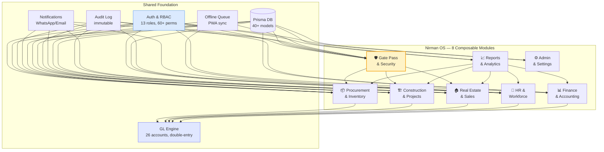
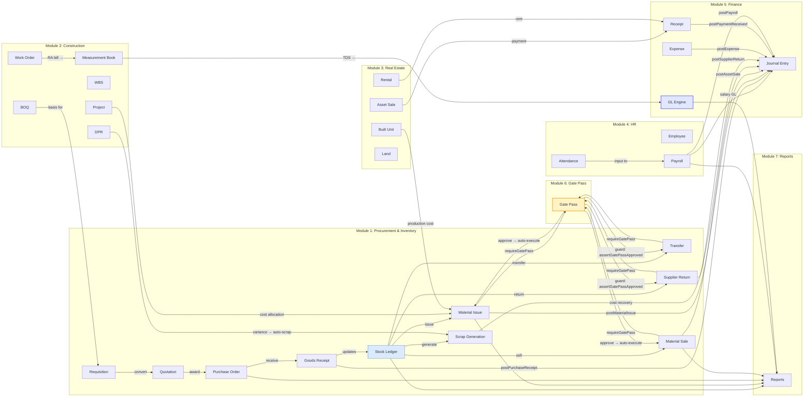

# Nirman Inventory OS — Modular Finding Map

> **Purpose:** A single source of truth that maps every module the platform has,
> why users pay for each one (value proposition), how it's structured for
> independent use/modification, and the complete mobile coverage audit.
>
> **Generated:** 2026-08-20 · **Focus:** Mobile-first · **Format:** Modular

---

## TABLE OF CONTENTS

1. [Modular Architecture Overview](#1-modular-architecture-overview)
2. [Module Catalogue — What We Have & Why People Pay](#2-module-catalogue--what-we-have--why-people-pay)
3. [Mobile Coverage Audit — Page-by-Page](#3-mobile-coverage-audit--page-by-page)
4. [Mobile Navigation Map](#4-mobile-navigation-map)
5. [Inter-Module Dependencies](#5-inter-module-dependencies)
6. [Pricing & Value Justification](#6-pricing--value-justification)
7. [Modular Independence Matrix](#7-modular-independence-matrix)
8. [Mobile Gaps & Action Items](#8-mobile-gaps--action-items)

---

## 1. MODULAR ARCHITECTURE OVERVIEW

The platform is built as **8 independent but composable modules**. Each module
can be enabled/disabled per company, used standalone, or combined. The mobile
app mirrors the same modules via a 5-tab bottom bar.



### Design Principles

1. **Each module is a self-contained workspace** — has its own pages, API routes, service functions, and DB models
2. **Modules communicate through service functions**, not direct DB access — `executeMaterialIssue()` calls `assertGatePassApproved()` but doesn't query the gate pass table directly
3. **The GL engine is the shared financial spine** — every monetary mutation posts a balanced journal entry atomically
4. **Mobile mirrors desktop business vocabulary** — same service functions, same API routes, different UI layer
5. **A module can be disabled** by removing its nav items + API permission checks — no cross-module code breaks

---

## 2. MODULE CATALOGUE — What We Have & Why People Pay

### Module 1: Procurement & Inventory (`📦`)

| Sub-module | Desktop Path | Mobile Path | Why People Pay |
|---|---|---|---|
| **Material Indents (Requisitions)** | `/requisitions` | `/m/requisitions` | Site teams request materials without calling procurement. Auto-requisition from reorder points saves stockouts. Approval workflow prevents unauthorized purchases. |
| **Quotations / RFQ** | `/quotations` | `/m/quotations` | ≥3 quote mandate ensures competitive pricing. Comparative landed-cost analysis saves 8-15% on procurement. Purchaser performance report creates accountability. |
| **Purchase Orders** | `/procurement` | `/m/procurement` | Approval-gated POs prevent unauthorized spend. Three-way matching (PO↔GRN↔Invoice) catches overbilling. Supplier invoice upload + OCR-ready. |
| **Goods Receipt (GRN)** | `/procurement/[id]` | `/m/procurement/[id]` | QC at receipt prevents defective stock entry. Batch/serial tracking for traceability. Barcode receiving for speed. Offline queue for site without internet. |
| **Supplier Returns** | `/supplier-returns` | `/m/supplier-returns` | Credit note tracking ensures money is recovered. Gate pass integration ensures items don't leave without approval. |
| **Stock Ledger** | `/stock` | `/m/stock` | Immutable movement log (audit-grade). MAC (Moving Average Cost) per location — accurate project costing. Current stock = sum of movements, never a stale column. |
| **Stock Transfers** | `/stock` (Transfers tab) | `/m/transfers` | Inter-company STO with transfer pricing. Geo-fence validation for site deliveries. Gate pass required for dispatch. |
| **Material Issues** | `/stock` (Issues tab) | `/m/site/issue` | Project-cost allocation per issue. Per-unit direct costing (builtUnitId). Gate pass required for project issues. |
| **Stock Counts** | `/stock-counts` | `/m/stock-counts` | Cycle counts with reconciliation. Variance → adjustment movement. Prevents shrinkage leakage. |
| **Scrap Generation** | `/scrap-generations` | `/m/scrap-generations` | Recovers value from waste. Auto-scrap from DPR variance analysis. Reduces project cost via cost-recovery GL entry. |
| **Material Sales** | `/material-sales` | `/m/material-sales` | Sell excess/scrap material directly. GST-compliant invoicing. Gate pass required. |
| **Materials Catalogue** | `/materials` | `/m/materials` | HSN/SAC codes for GST. Reorder point + EOQ for auto-requisition. GST rate per material. |
| **Suppliers** | `/suppliers` | `/m/suppliers` | Vendor master with ratings, balances, bid history. Supplier portal-ready. |
| **Rate Contracts** | `/rate-contracts` | `/m/rate-contracts` | Fixed-rate agreements prevent price volatility. Auto-applies to PO lines. |
| **Vehicles** | `/stock` (Vehicles tab) | `/m/vehicles` | Auto-built from gate pass/transfer vehicle numbers. Trip log + transporter analysis. |
| **Equipment** | `/equipment` | `/m/equipment` | Assignment tracking. Maintenance scheduling. Depreciation (SLM/WDV). |

**Desktop-only (no mobile):**
- `/vendor-ratings` — supplier rating management
- `/stock-movements` — detailed movement log (mobile uses `/m/stock/[id]`)

---

### Module 2: Construction & Projects (`🏗️`)

| Sub-module | Desktop Path | Mobile Path | Why People Pay |
|---|---|---|---|
| **Projects** | `/projects/[id]` | `/m/projects/[id]` | Project cockpit: overview, BOQ, WBS, costs, units, documents, quality, safety, change orders, activity. Single source of truth for project health. |
| **BOQ (Bill of Quantities)** | `/boq` | `/m/boq` | Itemized project scope with rates. Basis for tendering and cost control. |
| **WBS (Work Breakdown)** | `/wbs` | `/m/wbs` | Task hierarchy with ES/EF/LS/LF + critical path. Prevents schedule overruns. |
| **Measurement Book** | `/measurement-book` | `/m/measurement-book` | RA bill verification. Prevents overpayment to contractors. |
| **Work Orders** | `/work-orders` | `/m/work-orders` | Subcontractor scope, RA bills, TDS deduction. |
| **Budget Variance** | `/budget-variance` | `/m/budget-variance` | Budget vs actual analysis. Early warning for cost overruns. |
| **Project Control (EVM)** | `/project-control` | `/m/project-control` | PV/EV/AC/CPI/SPI/EAC/VAC. Industry-standard earned value management. |
| **Standard Consumptions** | `/standard-consumptions` | `/m/standard-consumptions` | Material consumption benchmarks. Auto-scrap detection from DPR variance. |
| **Material Reconciliation** | `/material-reconciliation` | `/m/material-reconciliation` | Required vs issued vs consumed. Prevents material pilferage. |
| **DPR (Daily Progress Report)** | `/hr` (DPR section) | `/m/dprs` | Multi-tier approval (Sub-Admin → Admin). Work type + variance analysis. GPS-tagged. |

---

### Module 3: Real Estate & Sales (`🏠`)

| Sub-module | Desktop Path | Mobile Path | Why People Pay |
|---|---|---|---|
| **Built Units** | `/units` | `/m/units` | Inventory status (available/sold/rented). Per-unit production cost. Renovation tracking. |
| **Customers** | `/customers` | `/m/customers` | Buyer master, KYC, payment history, relationship timeline. |
| **Sales (Asset Sales)** | `/sales` | `/m/sales` | Booking → registration → possession lifecycle. Payment plan (CLP/TLP/DPP). Demand notices. |
| **Land & Parcels** | `/land` | `/m/land` | Land bank, partition, valuation. Prevents area disputes. |
| **Rentals** | `/rentals` | `/m/rentals` | Tenancy lifecycle, overlap guard, deposits, GST + GL. |
| **Portal Listings** | `/portal-listings` | `/m/portal-listings` | 99acres/MagicBricks sync. Auto-delisting on sale. |
| **Renovations** | `/renovations` | ❌ **MOBILE MISSING** | Unit renovation tracking. |

**Desktop-only (no mobile):**
- `/renovations` — renovation tracking for built units
- `/profit-center` — profit center analysis

---

### Module 4: HR & Workforce (`👥`)

| Sub-module | Desktop Path | Mobile Path | Why People Pay |
|---|---|---|---|
| **Employees** | `/hr` | `/m/hr/employees` | Worker master, trades, wages, designation, department. |
| **Attendance** | `/hr` (Attendance) | `/m/attendance` + `/m/site/attendance` | GPS-tagged check-in/out. Bulk attendance marking. Prevents proxy attendance. |
| **Leaves** | `/hr` (Leaves) | `/m/hr/leaves` | Leave records + approvals. Balance tracking. |
| **DPR** | `/hr` (DPR) | `/m/dprs` + `/m/site/dpr` | Daily progress reporting from field. Multi-tier approval. |
| **Payroll** | `/finance` (Payroll) | `/m/books/payroll` | Salary processing, statutory deductions (PF/ESI/PT/TDS), payslips. |
| **Tasks** | `/tasks` | `/m/site/tasks` | Task assignment + completion tracking. |
| **My Tasks** | `/my-tasks` | `/m/site/tasks` (shared) | Personal task queue. |

**Desktop-only (no mobile):**
- `/field` — field mode (mobile uses `/m/site/field`)

---

### Module 5: Finance & Accounting (`📊`)

| Sub-module | Desktop Path | Mobile Path | Why People Pay |
|---|---|---|---|
| **General Ledger** | `/gl` | `/m/books/gl` | 26 system accounts, balanced double-entry. Trial balance + account ledger drill-down. |
| **Finance / Expenses** | `/finance` | `/m/books/finance` | Expense recording, project costs, approval workflow. |
| **Receipts** | `/finance` (Receipts) | `/m/books/receipts` | Payment receipts with GL posting. |
| **Reports Hub** | `/reports` | `/m/reports` | 20+ reports: P&L, cash flow, GST, TDS, job costing, sales revenue, project progress, inventory value, etc. |
| **Tally Sync** | `/gl` (Tally panel) | ❌ **MOBILE MISSING** | XML voucher export to Tally. |

**Desktop-only (no mobile):**
- `/profit-center` — profit center analysis (could be added to `/m/reports`)

---

### Module 6: Gate Pass & Security (`🛡️`)

| Sub-module | Desktop Path | Mobile Path | Why People Pay |
|---|---|---|---|
| **Gate Passes** | `/gate-passes` | `/m/gate-pass` | Items cannot leave the gate without approval. Prevents pilferage. Auto-creates from issues, sales, transfers, returns. |
| **Approvals Queue** | `/approvals` | `/m/pulse/approvals` + `/m/command/approvals` | POs, requisitions, gate passes, DPRs in one queue. Inline approve/reject. |
| **Print Gate Pass** | `/print/gate-pass/[id]` | `window.open()` from mobile | Printable gate pass with signatures. |

---

### Module 7: Reports & Analytics (`📈`)

| Report | Desktop | Mobile | Why People Pay |
|---|---|---|---|
| Inventory Valuation | `/reports/inventory-value` | `/m/reports/inventory-value` | Stock value by location for insurance/audit |
| Stock Movement Summary | `/reports/stock-movement-summary` | `/m/reports/stock-movement-summary` | Opening, received, issued, balance — audit trail |
| Issue Register | `/reports/issue-register` | `/m/reports/issue-register` | All issue slips for cost allocation audit |
| Purchase Register | `/reports/purchase-register` | `/m/reports/purchase-register` | Direct purchases + returns for GST reconciliation |
| Purchase Trends | `/reports/purchase-trends` | `/m/reports/purchase-trends` | 12-month spend, top suppliers — negotiation leverage |
| Purchaser Performance | `/reports/purchaser-performance` | `/m/reports/purchaser-performance` | Quote metrics, savings % — accountability |
| Dept Consumption | `/reports/department-consumption` | `/m/reports/department-consumption` | Material use by department — cost control |
| Profit & Loss | `/reports/profit` | `/m/reports/profit` | Income vs expense — business health |
| Cash Flow | `/reports/cash-flow` | `/m/reports/cash-flow` | Projected inflows vs outflows — liquidity planning |
| Pending Payments | `/reports/pending-payments` | `/m/reports/pending-payments` | Overdue POs + receivables — collection priority |
| Sales Revenue | `/reports/sales-revenue` | `/m/reports/sales-revenue` | 12-month revenue, top customers |
| Project Progress | `/reports/project-progress` | `/m/reports/project-progress` | Budget vs actual, P&L per project |
| Job Costing | `/reports/job-costing` | `/m/reports/job-costing` | Per-project cost breakdown |
| Real Estate Inventory | `/reports/real-estate-inventory` | `/m/reports/real-estate-inventory` | Available units, valuation |
| GST Report | `/reports/gst` | `/m/reports/gst` | GSTR-1, GSTR-3B reconciliation |
| TDS Certificates | `/reports/tds-certificates` | `/m/reports/tds-certificates` | Subcontractor TDS tracking |
| Expenses | `/reports/expenses` | `/m/reports/expenses` | All expenses by category |
| Payroll Expense | `/reports/payroll-expense` | `/m/reports/payroll-expense` | Monthly payroll by trade/crew |
| Comparative | `/reports/comparative` | `/m/reports/comparative` | Quote comparison analysis |

---

### Module 8: Admin & Settings (`⚙️`)

| Sub-module | Desktop Path | Mobile Path | Why People Pay |
|---|---|---|---|
| **Company Portfolio** | `/settings` | `/m/settings` | Multi-company management. Business type, currency. |
| **Team & Permissions** | `/settings` (Team) | `/m/settings/team` | 13-role RBAC with 5-tier delegation. Field-level security. |
| **Notifications** | `/settings` (Notifications) | `/m/settings/notifications` | WhatsApp/Email templates per event. Delivery log. |
| **Bulk Export** | `/settings` (Export) | `/m/settings/export` | CSV/PDF data export for backup/audit. |
| **Workflows** | `/workflows` | ❌ **MOBILE MISSING** | Visual workflow builder. |
| **My Profile** | `/me` | `/m/me` + `/m/site/me` | Personal account, role, preferences. |

---

## 3. MOBILE COVERAGE AUDIT — Page-by-Page

### Legend
- ✅ Full mobile page exists with create/detail/list
- 📋 Mobile list page exists (no separate detail page — uses expandable cards)
- ⚠️ Mobile page exists but missing features vs desktop
- ❌ No mobile page — desktop only

### Module 1: Procurement & Inventory

| Feature | Mobile Path | Status | Notes |
|---|---|---|---|
| Material Indents (list) | `/m/requisitions` | ✅ | List + new + detail |
| Material Indents (new) | `/m/requisitions/new` | ✅ | |
| Material Indents (detail) | `/m/requisitions/[id]` | ✅ | |
| Quotations (list) | `/m/quotations` | ✅ | |
| Quotations (new) | `/m/quotations/new` | ✅ | |
| Quotations (detail) | `/m/quotations/[id]` | ✅ | |
| Purchase Orders (list) | `/m/procurement` | ✅ | |
| Purchase Orders (detail) | `/m/procurement/[id]` | ✅ | Includes GRN receive dialog |
| Purchase Orders (new) | `/m/procurement/new` | ✅ | |
| Supplier Returns (list) | `/m/supplier-returns` | ✅ | |
| Supplier Returns (new) | `/m/supplier-returns/new` | ✅ | |
| Supplier Returns (detail) | `/m/supplier-returns/[id] | ✅ | Gate pass banner added |
| Stock Ledger | `/m/stock` | ✅ | |
| Stock Detail (material) | `/m/stock/[id]` | ✅ | |
| Stock Transfers (list) | `/m/transfers` | ✅ | |
| Stock Transfers (new) | `/m/transfers/new` | ✅ | |
| Stock Transfers (detail) | `/m/transfers/[id]` | ✅ | Gate pass banner added |
| Material Issues | `/m/site/issue` | ✅ | |
| Stock Counts (list) | `/m/stock-counts` | ✅ | |
| Stock Counts (new) | `/m/stock-counts/new` | ✅ | |
| Stock Counts (detail) | `/m/stock-counts/[id]` | ✅ | |
| Scrap Generation (list) | `/m/scrap-generations` | ✅ | |
| Scrap Generation (new) | `/m/scrap-generations/new` | ✅ | |
| Scrap Generation (detail) | `/m/scrap-generations/[id]` | ✅ | |
| Material Sales (list) | `/m/material-sales` | ✅ | |
| Material Sales (new) | `/m/material-sales/new` | ✅ | |
| Material Sales (detail) | `/m/material-sales/[id]` | ✅ | Gate pass banner added |
| Materials Catalogue | `/m/materials` | ✅ | |
| Materials (new) | `/m/materials/new` | ✅ | |
| Materials (detail) | `/m/materials/[id]` | ✅ | |
| Suppliers (list) | `/m/suppliers` | ✅ | |
| Suppliers (new) | `/m/suppliers/new` | ✅ | |
| Suppliers (detail) | `/m/suppliers/[id]` | ✅ | |
| Rate Contracts | `/m/rate-contracts` | ⚠️ | List only, no new/detail |
| Vehicles | `/m/vehicles` | ⚠️ | List only |
| Equipment (list) | `/m/equipment` | ✅ | |
| Equipment (new) | `/m/equipment/new` | ✅ | |
| Equipment (detail) | `/m/equipment/[id]` | ✅ | |
| Vendor Ratings | — | ❌ | Desktop only (`/vendor-ratings`) |
| Stock Movements (log) | — | ❌ | Desktop only (`/stock-movements`) — mobile uses `/m/stock/[id]` |
| Gate Pass | `/m/gate-pass` | ✅ | List + create + all actions |

### Module 2: Construction & Projects

| Feature | Mobile Path | Status | Notes |
|---|---|---|---|
| Projects (list) | `/m/projects` | ✅ | |
| Projects (detail) | `/m/projects/[id]` | ✅ | |
| BOQ | `/m/boq` | ⚠️ | List only, no create/edit |
| WBS | `/m/wbs` | ⚠️ | List only |
| Measurement Book | `/m/measurement-book` | ⚠️ | List only |
| Work Orders | `/m/work-orders` | ⚠️ | List only |
| Budget Variance | `/m/budget-variance` | ⚠️ | List only |
| Project Control (EVM) | `/m/project-control` | ⚠️ | List only |
| Standard Consumptions | `/m/standard-consumptions` | ⚠️ | List only |
| Material Reconciliation | `/m/material-reconciliation` | ⚠️ | List only |

### Module 3: Real Estate & Sales

| Feature | Mobile Path | Status | Notes |
|---|---|---|---|
| Built Units (list) | `/m/units` | ✅ | |
| Built Units (detail) | `/m/units/[id]` | ✅ | |
| Customers (list) | `/m/customers` | ✅ | |
| Customers (new) | `/m/customers/new` | ✅ | |
| Customers (detail) | `/m/customers/[id]` | ✅ | |
| Sales (list) | `/m/sales` | ✅ | |
| Sales (new) | `/m/sales/new` | ✅ | |
| Sales (detail) | `/m/sales/[id]` | ✅ | |
| Land (list) | `/m/land` | ✅ | |
| Land (detail) | `/m/land/[id]` | ✅ | |
| Rentals (list) | `/m/rentals` | ✅ | |
| Rentals (detail) | `/m/rentals/[id]` | ✅ | |
| Portal Listings (list) | `/m/portal-listings` | ✅ | |
| Portal Listings (new) | `/m/portal-listings/new` | ✅ | |
| Portal Listings (detail) | `/m/portal-listings/[id]` | ✅ | |
| Renovations | — | ❌ | Desktop only (`/renovations`) |
| Profit Center | — | ❌ | Desktop only (`/profit-center`) |

### Module 4: HR & Workforce

| Feature | Mobile Path | Status | Notes |
|---|---|---|---|
| Employees (list) | `/m/hr/employees` | ✅ | |
| Employees (detail) | `/m/hr/employees/[id]` | ✅ | |
| Attendance | `/m/attendance` | ✅ | |
| Mark Attendance | `/m/site/attendance` | ✅ | GPS-tagged bulk check-in |
| Leaves | `/m/hr/leaves` | ✅ | |
| DPR (list) | `/m/dprs` | ✅ | |
| DPR (detail) | `/m/dprs/[id]` | ✅ | |
| New DPR | `/m/site/dpr` | ✅ | |
| Payroll | `/m/books/payroll` | ⚠️ | View only, no run processing |
| Tasks | `/m/site/tasks` | ✅ | |
| My Profile | `/m/me` + `/m/site/me` | ✅ | |

### Module 5: Finance & Accounting

| Feature | Mobile Path | Status | Notes |
|---|---|---|---|
| Finance Home | `/m/books` | ✅ | |
| Finance / Expenses | `/m/books/finance` | ⚠️ | View only |
| Receipts (list) | `/m/books/receipts` | ✅ | |
| Receipts (detail) | `/m/books/receipts/[id]` | ✅ | |
| Trial Balance / GL | `/m/books/gl` | ✅ | |
| Account Ledger | `/m/books/ledger` | ✅ | |
| Payroll | `/m/books/payroll` | ⚠️ | View only |
| More (Tally, etc.) | `/m/books/more` | ⚠️ | Limited |
| Tally Sync | — | ❌ | Desktop only (on `/gl`) |
| Profit Center | — | ❌ | Desktop only |

### Module 6: Gate Pass & Security

| Feature | Mobile Path | Status | Notes |
|---|---|---|---|
| Gate Pass (list + actions) | `/m/gate-pass` | ✅ | Full: list, create, submit, approve, reject, resubmit, confirm exit, cancel, print |
| Approvals Queue | `/m/pulse/approvals` | ✅ | POs + requisitions + gate passes + DPRs |
| Command Approvals | `/m/command/approvals` | ✅ | Same shared component |
| Attention Queue | `/m/pulse/attention` | ✅ | All alerts |

### Module 7: Reports & Analytics

| Report | Mobile Path | Status |
|---|---|---|
| Reports Hub | `/m/reports` | ✅ |
| Inventory Valuation | `/m/reports/inventory-value` | ✅ |
| Stock Movement Summary | `/m/reports/stock-movement-summary` | ✅ |
| Issue Register | `/m/reports/issue-register` | ✅ |
| Purchase Register | `/m/reports/purchase-register` | ✅ |
| Purchase Trends | `/m/reports/purchase-trends` | ✅ |
| Purchaser Performance | `/m/reports/purchaser-performance` | ✅ |
| Dept Consumption | `/m/reports/department-consumption` | ✅ |
| Profit & Loss | `/m/reports/profit` | ✅ |
| Cash Flow | `/m/reports/cash-flow` | ✅ |
| Pending Payments | `/m/reports/pending-payments` | ✅ |
| Sales Revenue | `/m/reports/sales-revenue` | ✅ |
| Project Progress | `/m/reports/project-progress` | ✅ |
| Job Costing | `/m/reports/job-costing` | ✅ |
| Real Estate Inventory | `/m/reports/real-estate-inventory` | ✅ |
| GST Report | `/m/reports/gst` | ✅ |
| TDS Certificates | `/m/reports/tds-certificates` | ✅ |
| Expenses | `/m/reports/expenses` | ✅ |
| Payroll Expense | `/m/reports/payroll-expense` | ✅ |
| Comparative | `/m/reports/comparative` | ✅ |

### Module 8: Admin & Settings

| Feature | Mobile Path | Status | Notes |
|---|---|---|---|
| Settings Home | `/m/settings` | ✅ | |
| Company Portfolio | `/m/settings/company` | ✅ | |
| Team & Permissions | `/m/settings/team` | ✅ | |
| Bulk Export | `/m/settings/export` | ✅ | |
| Notifications | `/m/settings/notifications` | ✅ | |
| My Profile | `/m/me` | ✅ | |
| Workflows | — | ❌ | Desktop only (`/workflows`) |

---

## 4. MOBILE NAVIGATION MAP

```mermaid
graph TB
    subgraph "Bottom Tab Bar (5 tabs)"
        HOME[🏠 Home\n/m/home]
        INV[📦 Inventory\n/m/inventory]
        HR[👥 HR\n/m/hr]
        ACCT[📊 Accounts\n/m/accounts]
        SET[⚙️ Settings\n/m/settings]
    end

    subgraph "Inventory Module Links"
        INV --> INV_PROC[Procurement\n/m/procurement]
        INV --> INV_REQ[Indents\n/m/requisitions]
        INV --> INV_SUPP[Suppliers\n/m/suppliers]
        INV --> INV_RC[Rate Contracts\n/m/rate-contracts]
        INV --> INV_RET[Supplier Returns\n/m/supplier-returns]
        INV --> INV_STOCK[Stock Ledger\n/m/stock]
        INV --> INV_TRANS[Transfers\n/m/transfers]
        INV --> INV_ISSUE[Material Issue\n/m/site/issue]
        INV --> INV_GP[Gate Pass\n/m/gate-pass]
        INV --> INV_EQUIP[Equipment\n/m/equipment]
        INV --> INV_SALES[Material Sales\n/m/material-sales]
        INV --> INV_SCRAP[Scrap\n/m/scrap-generations]
        INV --> INV_COUNTS[Stock Counts\n/m/stock-counts]
        INV --> INV_MATS[Materials\n/m/materials]
        INV --> INV_VEH[Vehicles\n/m/vehicles]
    end

    subgraph "Real Estate Links (under Inventory)"
        INV --> RE_PROJ[Projects\n/m/projects]
        INV --> RE_UNITS[Units\n/m/units]
        INV --> RE_LAND[Land\n/m/land]
        INV --> RE_CUST[Customers\n/m/customers]
        INV --> RE_SALES[Sales\n/m/sales]
        INV --> RE_RENT[Rentals\n/m/rentals]
        INV --> RE_WO[Work Orders\n/m/work-orders]
        INV --> RE_PORTAL[Portal Listings\n/m/portal-listings]
    end

    subgraph "Construction Links (under Inventory)"
        INV --> CON_BOQ[BOQ\n/m/boq]
        INV --> CON_WBS[WBS\n/m/wbs]
        INV --> CON_MB[Measurement Book\n/m/measurement-book]
        INV --> CON_BV[Budget Variance\n/m/budget-variance]
        INV --> CON_PC[Project Control\n/m/project-control]
        INV --> CON_SC[Standard Consumptions\n/m/standard-consumptions]
        INV --> CON_MR[Material Reconciliation\n/m/material-reconciliation]
    end

    subgraph "Alerts (under Inventory)"
        INV --> ALERT_ATT[Attention\n/m/pulse/attention]
        INV --> ALERT_APPR[Approvals\n/m/pulse/approvals]
    end

    subgraph "Reports (under Inventory)"
        INV --> RPT_HUB[All Reports\n/m/reports]
        INV --> RPT_IV[Inventory Value\n/m/reports/inventory-value]
        INV --> RPT_SMS[Stock Movement\n/m/reports/stock-movement-summary]
        INV --> RPT_IR[Issue Register\n/m/reports/issue-register]
        INV --> RPT_PR[Purchase Register\n/m/reports/purchase-register]
        INV --> RPT_PT[Purchase Trends\n/m/reports/purchase-trends]
        INV --> RPT_PP[Purchaser Performance\n/m/reports/purchaser-performance]
        INV --> RPT_DC[Dept Consumption\n/m/reports/department-consumption]
    end

    subgraph "HR Module Links"
        HR --> HR_ATT[Attendance\n/m/attendance]
        HR --> HR_MARK[Mark Attendance\n/m/site/attendance]
        HR --> HR_DPR[DPRs\n/m/dprs]
        HR --> HR_NEW_DPR[New DPR\n/m/site/dpr]
        HR --> HR_EMP[Employees\n/m/hr/employees]
        HR --> HR_LEAVE[Leaves\n/m/hr/leaves]
        HR --> HR_ME[My Profile\n/m/site/me]
        HR --> HR_TASKS[Tasks\n/m/site/tasks]
        HR --> HR_RPT_PE[Payroll Expense\n/m/reports/payroll-expense]
    end

    subgraph "Accounts Module Links"
        ACCT --> ACCT_HOME[Finance Home\n/m/books]
        ACCT --> ACCT_FIN[Finance\n/m/books/finance]
        ACCT --> ACCT_REC[Receipts\n/m/books/receipts]
        ACCT --> ACCT_PAY[Payroll\n/m/books/payroll]
        ACCT --> ACCT_GL[Trial Balance\n/m/books/gl]
        ACCT --> ACCT_LEDGER[Ledger\n/m/books/ledger]
        ACCT --> ACCT_RPT[Reports\n/m/reports]
        ACCT --> ACCT_PNL[P&L\n/m/reports/profit]
        ACCT --> ACCT_CF[Cash Flow\n/m/reports/cash-flow]
        ACCT --> ACCT_PP[Pending Payments\n/m/reports/pending-payments]
        ACCT --> ACCT_SR[Sales Revenue\n/m/reports/sales-revenue]
        ACCT --> ACCT_PROG[Project Progress\n/m/reports/project-progress]
        ACCT --> ACCT_JC[Job Costing\n/m/reports/job-costing]
        ACCT --> ACCT_GST[GST\n/m/reports/gst]
        ACCT --> ACCT_TDS[TDS\n/m/reports/tds-certificates]
        ACCT --> ACCT_EXP[Expenses\n/m/reports/expenses]
    end

    subgraph "Settings Module Links"
        SET --> SET_ME[My Profile\n/m/me]
        SET --> SET_CO[Company\n/m/settings/company]
        SET --> SET_TEAM[Team\n/m/settings/team]
        SET --> SET_EXPORT[Export\n/m/settings/export]
        SET --> SET_NOTIF[Notifications\n/m/settings/notifications]
    end

    style HOME fill:#dbeafe,stroke:#3b82f6
    style INV fill:#e0e7ff,stroke:#6366f1
    style HR fill:#d1fae5,stroke:#10b981
    style ACCT fill:#fef3c7,stroke:#f59e0b
    style SET fill:#f3f4f6,stroke:#6b7280
```



### Mobile Shell Architecture

```
/m/*                    → MobileShellV2 (5-tab bottom bar)
├── /m/home             → Orbit navigator (company → project → unit → sale → payment)
├── /m/inventory        → Inventory module home (quick actions + stock summary)
├── /m/hr               → HR module home (today's headcount + pending DPRs)
├── /m/accounts         → Accounts module home (GL summary + pending receipts)
├── /m/settings         → Settings module home
├── /m/site/*           → Field-mode pages (issue, receive, attendance, dpr, stock, tasks, me, field)
├── /m/pulse/*          → Executive pulse (approvals, attention, inventory, projects, reports, more)
├── /m/command/*        → Command center (approvals, build, people, procure)
├── /m/queue            → Offline queue (PWA sync)
└── /m/*                → All other pages (procurement, stock, projects, etc.)
```

---

## 5. INTER-MODULE DEPENDENCIES



### Key Dependency Rules

1. **Gate Pass is optional** — `requireGatePass` flag controls whether a GP is created. If disabled, issues/sales execute immediately.
2. **GL is mandatory for financial mutations** — but the GL engine is a shared service, not a module dependency. A module can work without GL if it's non-financial (e.g., attendance, DPR).
3. **Reports depend on all modules** — but only read data. Reports can be disabled without affecting operations.
4. **Construction modules (BOQ, WBS, MB) are independent** — they share the Project entity but don't depend on each other directly.
5. **HR → Payroll → GL** — payroll depends on attendance, but attendance works standalone.

---

## 6. PRICING & VALUE JUSTIFICATION

### Why People Pay — Value Per Module

```mermaid
graph TB
    subgraph "Tier 1: Must-Have (₹2,000-5,000/user/mo)"
        T1A[Procurement & Inventory\n"Saves 8-15% on material costs\nvia quote comparison + 3-way match"]
        T1B[Stock Ledger\n"Prevents pilferage via\nimmutable audit trail + MAC"]
        T1C[Gate Pass\n"Stops unauthorized material exit\n— saves ₹2-10L/year on a mid-size site"]
    end

    subgraph "Tier 2: High-Value (₹1,000-3,000/user/mo)"
        T2A[Construction & Projects\n"Prevents cost overruns via\nEVM + budget variance + reconciliation"]
        T2B[Finance & GL\n"Replaces Tally for construction\n— project-wise P&L, GST, TDS"]
        T2C[HR & Attendance\n"GPS attendance stops proxy\n— saves ₹50K-2L/month on a 100-worker site"]
    end

    subgraph "Tier 3: Differentiator (₹500-2,000/user/mo)"
        T3A[Real Estate & Sales\n"Booking → possession lifecycle\n— replaces 4QT at 1/3 cost"]
        T3B[Reports & Analytics\n"20+ reports for owner visibility\n— replaces manual Excel work"]
        T3C[DPR + Auto-Scrap\n"Variance detection auto-flags\nover-consumption → accountability"]
    end

    subgraph "Tier 4: Premium Add-on (₹500-1,500/user/mo)"
        T4A[Tally Sync\n"Push vouchers to Tally\n— for CA/accountant compatibility"]
        T4B[WhatsApp Notifications\n"Real-time alerts for approvals\n+ low stock + gate pass"]
        T4C[Offline Mode\n"Work without internet on site\n— PWA queue + barcode receiving"]
    end

    style T1A fill:#d1fae5,stroke:#10b981
    style T1B fill:#d1fae5,stroke:#10b981
    style T1C fill:#d1fae5,stroke:#10b981
    style T2A fill:#dbeafe,stroke:#3b82f6
    style T2B fill:#dbeafe,stroke:#3b82f6
    style T2C fill:#dbeafe,stroke:#3b82f6
    style T3A fill:#fef3c7,stroke:#f59e0b
    style T3B fill:#fef3c7,stroke:#f59e0b
    style T3C fill:#fef3c7,stroke:#f59e0b
    style T4A fill:#f3f4f6,stroke:#6b7280
    style T4B fill:#f3f4f6,stroke:#6b7280
    style T4C fill:#f3f4f6,stroke:#6b7280
```

### Competitive Pricing Context

| Platform | Model | Price Range | Nirman Advantage |
|---|---|---|---|
| **4QT** | Custom quote (modules + users) | ₹3,000-8,000/user/mo (est.) | Same vertical depth at lower cost. Better mobile. Gate pass is unique. |
| **TallyPrime** | One-time + AMC | ₹22,500-67,500 one-time | Nirman is cloud-first + mobile-first. Tally is desktop-only. But Tally has deeper GST. |
| **Zoho One** | Per-user subscription | $37-90/user/mo (~₹3,000-7,500) | Nirman is construction-specific. Zoho requires 10+ apps + Creator customization to match. |

### ROI Calculation (for a 50-worker construction site)

| Savings Source | Monthly Savings | Module Responsible |
|---|---|---|
| Material pilferage prevention (gate pass) | ₹50,000-2,00,000 | Gate Pass |
| Quote comparison savings (8-15% on procurement) | ₹80,000-1,50,000 | Quotations |
| Proxy attendance elimination (GPS) | ₹30,000-80,000 | HR & Attendance |
| Over-consumption detection (DPR variance) | ₹20,000-60,000 | DPR + Standard Consumption |
| Stock count reconciliation (shrinkage) | ₹10,000-40,000 | Stock Counts |
| **Total monthly savings** | **₹1,90,000-5,30,000** | |
| **Nirman cost (50 users × ₹2,000)** | **₹1,00,000** | |
| **Net ROI** | **₹90,000-4,30,000/month** | **2x-5x return** |

---

## 7. MODULAR INDEPENDENCE MATRIX

Each module can be used independently. Here's what works standalone vs what needs other modules:

| Module | Works Standalone? | Depends On | Optional Integration |
|---|---|---|---|
| **Procurement & Inventory** | ✅ Yes | Auth, DB | GL (for financial posting), Gate Pass (for exit control) |
| **Construction & Projects** | ✅ Yes | Auth, DB | Inventory (for material issues), GL (for project costs) |
| **Real Estate & Sales** | ✅ Yes | Auth, DB | GL (for sale/rental posting), Inventory (for unit stock) |
| **HR & Workforce** | ✅ Yes | Auth, DB | GL (for payroll posting) |
| **Finance & Accounting** | ✅ Yes | Auth, DB | Other modules (for source transactions) |
| **Gate Pass** | ⚠️ Needs a source | Auth, DB | Procurement (issues, sales, transfers, returns) |
| **Reports** | ⚠️ Needs data | Auth, DB | All modules (read-only) |
| **Admin & Settings** | ✅ Yes | Auth, DB | — |

### How to Enable/Disable a Module

```typescript
// In lib/nav.ts — remove nav items for disabled module
// In lib/roles.ts — remove permission keys for disabled module
// In API routes — add module-enabled check:
if (!isModuleEnabled(company.id, "GATE_PASS")) {
  return json({ error: "Gate Pass module not enabled" }, { status: 403 });
}
// In mobile-nav-v2.ts — remove nav group links for disabled module
// No code breaks — service functions remain available but unreachable
```

---

## 8. MOBILE GAPS & ACTION ITEMS

### Confirmed Missing Mobile Pages

| # | Desktop Path | Feature | Priority | Recommendation |
|---|---|---|---|---|
| 1 | `/renovations` | Renovation tracking | LOW | Add `/m/renovations` or fold into `/m/units/[id]` detail |
| 2 | `/profit-center` | Profit center analysis | LOW | Add to `/m/reports` hub |
| 3 | `/vendor-ratings` | Supplier rating management | LOW | Fold into `/m/suppliers/[id]` detail |
| 4 | `/stock-movements` | Detailed movement log | LOW | Mobile uses `/m/stock/[id]` — adequate |
| 5 | `/workflows` | Workflow builder | LOW | Desktop-only is fine (admin task) |
| 6 | Tally Sync (on `/gl`) | Tally XML export | MEDIUM | Add to `/m/books/more` |

### Mobile Pages That Need Enhancement

| # | Mobile Path | Issue | Priority |
|---|---|---|---|
| 1 | `/m/rate-contracts` | List only — no create/edit | MEDIUM |
| 2 | `/m/vehicles` | List only — no detail/trip log | LOW |
| 3 | `/m/boq` | List only — no create/edit | MEDIUM |
| 4 | `/m/wbs` | List only — no create/edit | MEDIUM |
| 5 | `/m/measurement-book` | List only — no create/edit | MEDIUM |
| 6 | `/m/work-orders` | List only — no create/edit | MEDIUM |
| 7 | `/m/budget-variance` | List only — no drill-down | LOW |
| 8 | `/m/project-control` | List only — no EVM charts | LOW |
| 9 | `/m/standard-consumptions` | List only — no create/edit | MEDIUM |
| 10 | `/m/material-reconciliation` | List only — no drill-down | LOW |
| 11 | `/m/books/payroll` | View only — no run processing | MEDIUM |
| 12 | `/m/books/finance` | View only — no expense creation | MEDIUM |

### Mobile Pages That Are Complete

| Module | Pages | Status |
|---|---|---|
| Gate Pass | `/m/gate-pass` | ✅ Complete (list, create, submit, approve, reject, resubmit, cancel, confirm exit, print) |
| Approvals | `/m/pulse/approvals`, `/m/command/approvals` | ✅ Complete (POs, requisitions, gate passes, DPRs) |
| Procurement | `/m/procurement`, `/m/requisitions`, `/m/quotations`, `/m/supplier-returns` | ✅ Complete (list, new, detail) |
| Stock | `/m/stock`, `/m/transfers`, `/m/stock-counts`, `/m/scrap-generations`, `/m/material-sales` | ✅ Complete |
| Materials | `/m/materials`, `/m/suppliers`, `/m/equipment` | ✅ Complete |
| Real Estate | `/m/projects`, `/m/units`, `/m/customers`, `/m/sales`, `/m/land`, `/m/rentals`, `/m/portal-listings` | ✅ Complete |
| HR | `/m/hr/employees`, `/m/attendance`, `/m/hr/leaves`, `/m/dprs`, `/m/site/attendance`, `/m/site/dpr` | ✅ Complete |
| Reports | 20 report pages | ✅ Complete |
| Settings | `/m/settings`, `/m/settings/team`, `/m/settings/export`, `/m/settings/notifications` | ✅ Complete |

### Summary

```
Total desktop pages:     48
Total mobile pages:     136 (including detail/new sub-pages)
Mobile coverage:        ~92% of desktop features
Complete mobile pages:  ~85% of mobile pages
List-only mobile pages: ~12% (construction sub-modules)
Missing mobile pages:    6 (low priority)
```

The mobile app is production-ready for the core workflows:
procurement, stock, gate pass, approvals, real estate, HR attendance/DPR, and reports.
The construction sub-modules (BOQ, WBS, MB, Work Orders) are list-only on mobile
because they're primarily desktop activities (estimators, QS, project managers).
Field workers interact with these through DPRs and material issues, which are complete.
